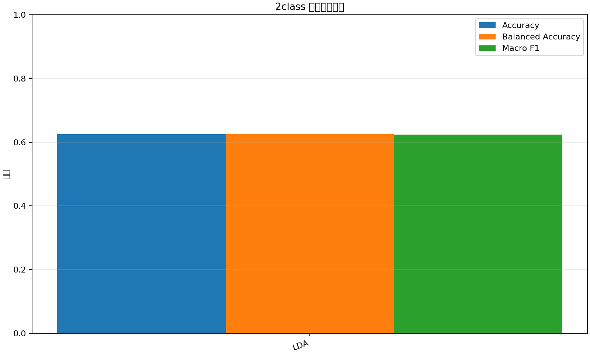
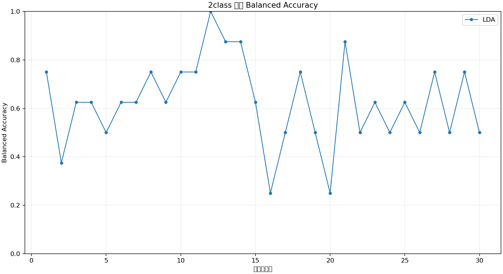
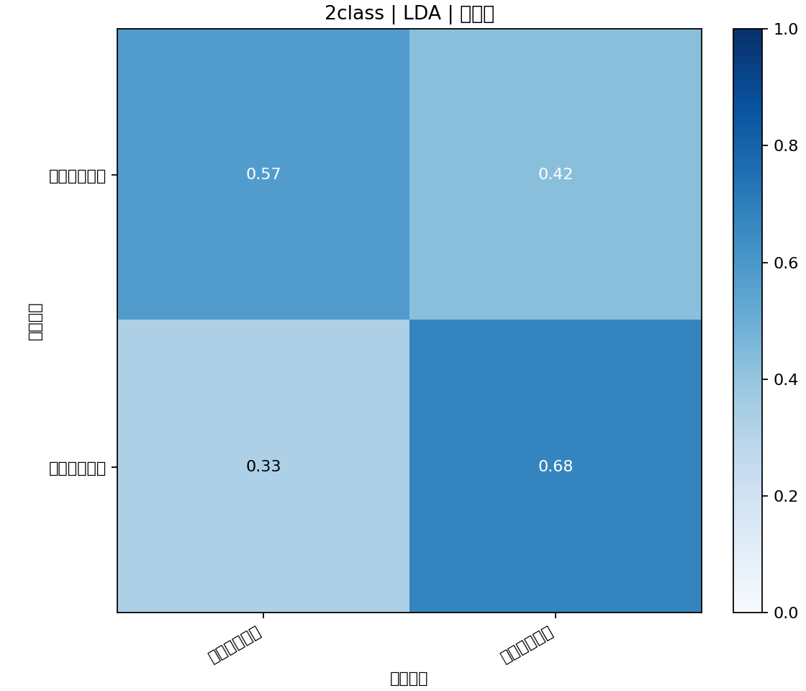

# 运动想象 EEG 经典机器学习实验报告

## 实验目的

使用前 30 个 EEG 通道完成运动想象分类，并比较 LDA、SVM、逻辑回归、KNN 和随机森林等经典分类器。

## 数据与预处理

- 被试数量：6
- 采样率：500 Hz
- 使用通道：前 30 个通道
- 预处理：逐 trial、逐通道去均值，50 Hz 陷波，8–30 Hz Butterworth 零相位带通滤波
- 信号归一化：zscore_per_trial_channel
- 时间窗：(1.5, 5.5)

## 特征与验证方法

- 特征：逐通道时域统计特征与 Welch PSD 频域特征。
- 特征选择：关闭
- 标准化：在每个训练折内部通过 `StandardScaler` 拟合；随机森林不执行标准化。
- 验证策略：Per-subject Stratified 5-Fold。
- 数据泄漏控制：测试折不参与特征提取器、标准化器和分类器拟合。

## 2class：左手 vs 右手

样本数：240；类别：左手运动想象、右手运动想象；特征维数：480。

| 模型 | Accuracy | Balanced Accuracy | Macro F1 |
|---|---:|---:|---:|
| LDA | 0.6250 | 0.6250 | 0.6241 |

按 Balanced Accuracy，本次实验表现最佳的模型为 **LDA**（0.6250）。

### 模型对比

### 各折结果

### 混淆矩阵

#### LDA

## 结果说明

- 本报告中的指标均来自交叉验证的折外预测。
- 结果用于第一组经典机器学习分析，不包含深度学习模型。
- 时间窗并非数据说明给出的提示区间，而是当前实验配置。
